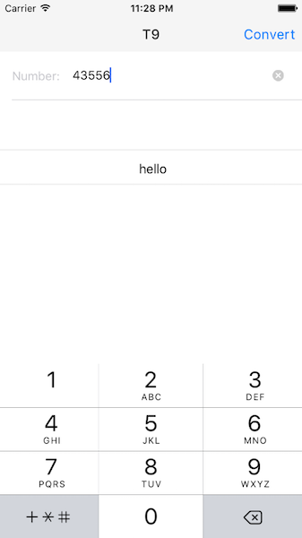

#Number to word list converter
=====================

##Task
====
Implement a number to word list converter as a Node backend and React/Redux fronted.

The backend should provide a rest endpoint that converts a given numeric string into a list of corresponding words in the style of T9 [https://en.wikipedia.org/wiki/T9_(predictive_text)] or Phonewords [https://en.wikipedia.org/wiki/Phoneword]. For example, given the input 23 the output should be: ad, ae, af, bd, be, bf, cd, ce, cf

The frontend should allow the user to enter a number, query the backend for the corresponding expansions, and display them.

Ways to go beyond the minimal solution could include for example:
- phone keyboard -like UI
- great project setup
- mobile app in React Native
- filtering to include only real words based on a suitable word list



##requirements
====
- [React Native](https://facebook.github.io/react-native/docs/getting-started.html) (v0.32)
- Xcode 7.0 or higher

##setup project
====
1. Clone project.

2.  Install dependencies:
```
npm i && cd server && npm i
```

##development
====
1. Run server from `server` directory
```
cd server && npm start
```
2.  Run app in simulator (in project's root directory):
```
react-native run-ios
```
Or open `ios/NumberToWord.xcodeproj` and hit "Run".


##FIX REACT-NATIVE FOR RELEASE
====
After installation of any node module, please call
```
gulp fix
```

stop package manager if running in terminal and call
```
watchman watch-del-all
```
